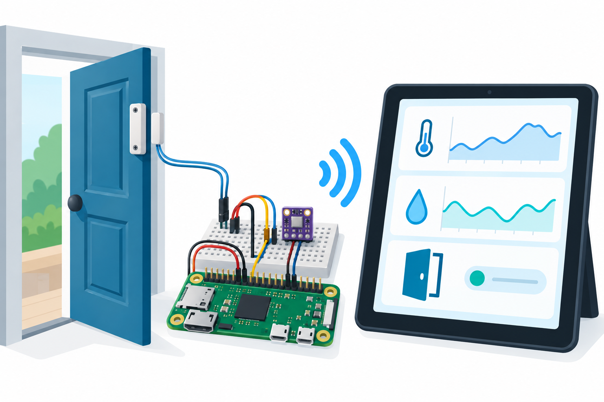

# Smart Entryway Live Dashboard

A Raspberry Pi Zero 2 W prototype displaying BME280 temperature, humidity, pressure and a door reed contact on a live local dashboard. Optional BLE exposes compact read/notify telemetry.



## Overview, objectives and features
Learn real I2C compensation, normally closed contact inputs, live HTTP polling, compact BLE telemetry and invalid-reading handling. Simulation works without GPIO or Bluetooth; hardware mode uses real adapters. The original Controller API and established CLI remain covered.

## Architecture and platform
Pi Zero 2 W, Raspberry Pi OS with Python 3.11+, I2C1, GPIOZero and BlueZ/Bless. A one-second sample loop feeds a threaded HTTP page/JSON endpoint and optional custom BLE service. [Architecture](docs/architecture.md). This is a monitor with no lock or actuator.

## BOM quantities
| Quantity | Item |
|---|---|
| 1 | Pi Zero 2 W with 40-pin header |
| 1 | BME280 3.3V I2C breakout |
| 1 | NC magnetic door contact plus magnet |
| 1 each | microSD with Raspberry Pi OS, 5V USB supply, breadboard |
| 6 | Jumper wires |
| 1 optional | BLE central phone/computer |

## Prerequisites
Python 3.11+, enabled I2C, GPIO/I2C group permissions and local USB access. Install OS packages python3-venv, i2c-tools and bluetooth. BLE requires a working BlueZ adapter and DBus permissions. Keep dashboard and BLE within a trusted lab; no authentication or TLS is implemented.

## Exact pin map and circuit/wiring
| Physical Pi pin | Signal |
|---|---|
| 1 / 3V3 | BME VCC and CSB |
| 3 / BCM2 SDA | BME SDA |
| 5 / BCM3 SCL | BME SCL |
| 6 / GND | BME GND/SDO and reed return |
| 16 / BCM23 | NC reed contact to GND |

BME address is 0x76. Internal BCM23 pull-up: closed contact LOW means closed door. [Precise editable SVG](docs/circuit-diagram.svg) and [wiring](docs/wiring.md). No 5V on GPIO.

## Assembly
Disconnect power. Connect grounds, 3.3V rail and I2C, then the reed. Mount the magnet to close the contact when the door is shut. Inspect for shorts and verify addresses. Power Pi through PWR IN USB. A broken contact wire appears as an open door.

## Setup and flashing
Pi uses OS deployment:
```sh
sudo apt install python3-venv i2c-tools bluetooth
sudo raspi-config
# Enable I2C; reboot if requested.
i2cdetect -y 1
python3 -m venv .venv
. .venv/bin/activate
pip install -r requirements.txt
python -m src.main --iterations 2 --interval 0
python -m src.main --hardware
```
Default dashboard: http://127.0.0.1:8080. GPIO and I2C permissions must allow the current user. Follow the OS's group setup; no blanket privileged access is required by the application.

## Configuration and usage
```sh
python -m src.main --hardware --bind 0.0.0.0 --port 8080 --interval 1
python -m src.main --hardware --ble
```
Explicit LAN binding is for an isolated lab only. BLE adapter must be powered and available. The browser polls /api/status every two seconds. Zero iterations runs continuously; a finite count supports repeatable simulation. CTRL-C exits. BLE service UUID: ce110001-9b71-4b58-bf08-907a20701100; characteristic UUID: ce110002-9b71-4b58-bf08-907a20701100. Read/notify only, no control commands.

## Telemetry/data formats
HTTP and USB JSON: project_id=11, seq, temperature_c, humidity_pct, pressure_hpa, door_open and valid. Nonfinite climate or readings outside -40..85°C, 0..100% RH, 300..1100hPa are invalid and become null. [Sample](sample-data/telemetry.jsonl) is simulation.

BLE is seven bytes, little-endian struct `<HhHB`: unsigned 16-bit sequence modulo 65536; signed 16-bit temperature in centi°C; unsigned 16-bit humidity in centipercent; flags (bit0 door_open, bit1 valid). Invalid climate uses zero values with the valid bit clear. Pressure is available only via HTTP. Check valid before interpreting zero values.

## Expected output
Simulation starts at 22.1°C then 22.2°C, cycles temperature and alternates door state. Dashboard updates JSON. Hardware values depend on the environment. Door opening changes door_open; bad climate measurement sets valid=false. No history database or charts are implemented; the illustration is conceptual.

## Actual run test results
[Validation results](docs/validation-results.md) records observed cloud checks. Physical Pi, sensors and BLE testing have not been performed.
```sh
python -m compileall -q src tests
python -m unittest discover -s tests
python tests/http_smoke.py
python tools/validate.py
python tools/validate_completion.py
```
Pi/Linux Python compilation and HTTP tests validate the application; no MCU board build applies.

## Troubleshooting
No I2C device: check 3.3V rails, SDO strap, address and enabled I2C. BMP280 lacks humidity. Door stuck: check NC contact type, magnet placement and pull-up. BLE registration denied: inspect BlueZ adapter and DBus permissions. Port busy: change --port. Simulation requires no GPIO dependencies.

## Limitations and domain safety
No alarm certification, contact tamper diagnosis, calibration or radio availability guarantee. LAN HTTP and BLE are unauthenticated and may expose occupancy. Default HTTP loopback reduces exposure; do not publish it to the internet. Do not rely on this monitor for security, emergencies or access decisions. No actuator or mains wiring.

## Future work
Add secured dashboard access, history plots, radio integration tests, contact debounce characterization and calibration.

## Contributing and license
Preserve compatibility and packet tests; changed pins must update docs and SVG. See [test plan](docs/test-plan.md). Full [MIT license](LICENSE); contributions use MIT.
